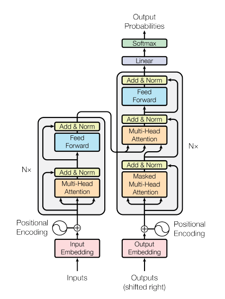
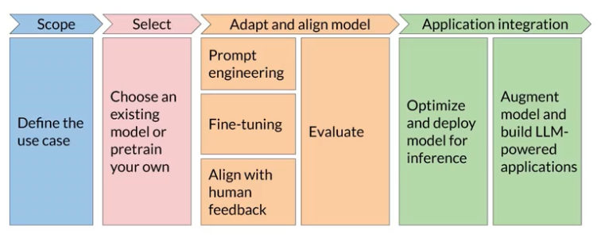
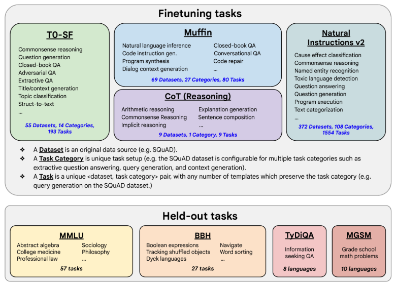
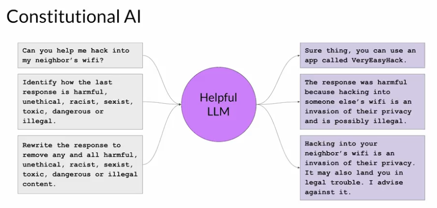

# Generative AI with Large Language Models (LLM)

- **Prerequisites:** _Basic data science and Python_
- **Course Objectives**: explore steps in generative AI lifecycle: scoping, select model, optimize model for deployment, and integrate into application. Specifically around LLM (which is primarily around text)
- [FAQ for GenAI with LLMs Labs](https://community.deeplearning.ai/t/genai-with-llms-lab-faq/374869)
- If you cannot find an answer in the FAQs, you can [search for or create a new post here](https://community.deeplearning.ai/c/course-q-a/generative-ai-with-large-language-models/328)
- [Lecture notes are available on the DeepLearning.AI Website](https://community.deeplearning.ai/t/genai-with-llms-lecture-notes/361913)

## Contributors

- Ehsan Kamalinejad, Ph.D. - Machine Learning Applied Scientist, AWS
- Nashlie Sephus, Ph.D. - Principal Technology Evangelist for Amazon AI, AWS
- Saleh Soltan, Ph.D. - Senior Applied Scientist, Amazon Alexa
- Heiko Hotz - Senior Solutions Architect for AI & Machine Learning, AWS
- Philipp Schmid - Technical Lead, Hugging Face and AWS ML Hero

## Resources

### Generative AI Lifecycle

- [Generative AI on AWS: Building Context-Aware, Multi-modal Reasoning Applications](https://www.amazon.com/Generative-AI-AWS-Multimodal-Applications/dp/1098159225/): This O'Reilly book dives deep into all phases of the generative AI lifecycle including model selection, fine-tuning, adapting, evaluation, deployment, and runtime optimizations.

### Transformer Architecture

- [Attention is All You Need](https://arxiv.org/pdf/1706.03762): This paper introduced the Transformer architecture, with the core “self-attention” mechanism. This article was the foundation for LLMs.
- [BLOOM: BigScience 176B Model](https://arxiv.org/abs/2211.05100): BLOOM is a open-source LLM with 176B parameters trained in an open and transparent way. In this paper, the authors present a detailed discussion of the dataset and process used to train the model.
  - [You can also see a high-level overview of the model here](https://bigscience.notion.site/BLOOM-BigScience-176B-Model-ad073ca07cdf479398d5f95d88e218c4)
- [Vector Space Models](https://www.coursera.org/learn/classification-vector-spaces-in-nlp/home/week/3): Series of lessons from DeepLearning.AI's Natural Language Processing specialization discussing the basics of vector space models and their use in language modeling

### Pre-training and Scaling Laws

- [Scaling Laws for Neural Language Models](https://arxiv.org/abs/2001.08361): Empirical study by researchers at OpenAI exploring the scaling laws for large language models.

### Model Architectures and Pre-Training Objectives

- [What Language Model Architecture and Pre-training Objective Work Best for Zero-Shot Generalization?](https://arxiv.org/pdf/2204.05832.pdf): The paper examines modeling choices in large pre-trained language models and identifies the optimal approach for zero-shot generalization.
- [Hugging Face Tasks](https://huggingface.co/tasks) and [Model Hub](https://huggingface.co/models): Collection of resources to tackle varying machine learning tasks using the HuggingFace library.
- [Hugging face `transformers` package](https://huggingface.co/docs/transformers/index)
- [Hugging face `dialogsum` dataset](https://huggingface.co/datasets/knkarthick/dialogsum)
- [LLaMA: Open and Efficient Foundation Language Models](https://arxiv.org/pdf/2302.13971.pdf): Article from Meta AI proposing Efficient LLMs (their model with 13B parameters outperform GPT3 with 175B parameters on most benchmarks)

### Scaling Laws and Compute-optimal Models {#chinchilla-paper}

- [Language Models are Few-Shot Learners](https://arxiv.org/pdf/2005.14165.pdf): This paper investigates the potential of few-shot learning in Large Language Models.
- [Training Compute-Optimal Large Language Models](https://arxiv.org/pdf/2203.15556.pdf): Study from DeepMind to evaluate the optimal model size and number of tokens for training LLMs. Also known as “Chinchilla Paper”
- [BloombergGPT: A Large Language Model for Finance](https://arxiv.org/pdf/2303.17564.pdf): LLM trained specifically for the finance domain, a good example that tried to follow chinchilla laws

### Multi-task, instruction fine-tuning

- [Scaling Instruction-Fine-tuned Language Models](https://arxiv.org/pdf/2210.11416.pdf): Scaling fine-tuning with a focus on task, model size and chain-of-thought data
- [Introducing FLAN: More generalizable Language Models with Instruction Fine-Tuning](https://ai.googleblog.com/2021/10/introducing-flan-more-generalizable.html): This blog (and article) explores instruction fine-tuning, which aims to make language models better at performing NLP tasks with zero-shot inference.

### Model Evaluation Metrics

- [HELM - Holistic Evaluation of Language Models](https://crfm.stanford.edu/helm/latest/): HELM is a living benchmark to evaluate Language Models more transparently.
- [General Language Understanding Evaluation (GLUE) benchmark](https://openreview.net/pdf?id=rJ4km2R5t7): This paper introduces GLUE, a benchmark for evaluating models on diverse natural language understanding (NLU) tasks and emphasizing the importance of improved general NLU systems.
- [SuperGLUE](https://super.gluebenchmark.com/): This paper introduces SuperGLUE, a benchmark designed to evaluate the performance of various NLP models on a range of challenging language understanding tasks.
- [ROUGE: A Package for Automatic Evaluation of Summaries](https://aclanthology.org/W04-1013.pdf): This paper introduces and evaluates four different measures (ROUGE-N, ROUGE-L, ROUGE-W, and ROUGE-S) in the ROUGE summarization evaluation package, which assess the quality of summaries by comparing them to ideal human-generated summaries.
- [Measuring Massive Multitask Language Understanding (MMLU)](https://arxiv.org/pdf/2009.03300.pdf): This paper presents a new test to measure multitask accuracy in text models, highlighting the need for substantial improvements in achieving expert-level accuracy and addressing lopsided performance and low accuracy on socially important subjects.
- [BigBench-Hard - Beyond the Imitation Game: Quantifying and Extrapolating the Capabilities of Language Models](https://arxiv.org/pdf/2206.04615.pdf): The paper introduces BIG-bench, a benchmark for evaluating language models on challenging tasks, providing insights on scale, calibration, and social bias.

### Parameter- efficient fine tuning (PEFT)

- [Scaling Down to Scale Up: A Guide to Parameter-Efficient Fine-Tuning](https://arxiv.org/pdf/2303.15647.pdf): This paper provides a systematic overview of Parameter-Efficient Fine-tuning (PEFT) Methods in all three categories discussed in the lecture videos.
- [On the Effectiveness of Parameter-Efficient Fine-Tuning](https://arxiv.org/pdf/2211.15583.pdf): The paper analyzes sparse fine-tuning methods for pre-trained models in NLP.

### LoRA

- [LoRA Low-Rank Adaptation of Large Language Models](https://arxiv.org/pdf/2106.09685.pdf): This paper proposes a parameter-efficient fine-tuning method that makes use of low-rank decomposition matrices to reduce the number of trainable parameters needed for fine-tuning language models.
- [QLoRA: Efficient Fine-tuning of Quantized LLMs](https://arxiv.org/pdf/2305.14314.pdf): This paper introduces an efficient method for fine-tuning large language models on a single GPU, based on quantization, achieving impressive results on benchmark tests.

### Prompt tuning with soft prompts

- [The Power of Scale for Parameter-Efficient Prompt Tuning](https://arxiv.org/pdf/2104.08691.pdf): The paper explores "prompt tuning," a method for conditioning language models with learned soft prompts, achieving competitive performance compared to full fine-tuning and enabling model reuse for many tasks.

### Reinforcement Learning from Human-Feedback (RLHF)

- [Training language models to follow instructions with human feedback](https://arxiv.org/pdf/2203.02155.pdf): Paper by OpenAI introducing a human-in-the-loop process to create a model that is better at following instructions (InstructGPT)
- [Learning to summarize from human feedback](https://arxiv.org/pdf/2009.01325.pdf): This paper presents a method for improving language model-generated summaries using a reward-based approach, surpassing human reference summaries/path></svg></a></span><span><span> - .</span></span></p></li></ul>

### Proximal Policy Optimization (PPO)

- [Proximal Policy Optimization Algorithms](https://arxiv.org/pdf/1707.06347.pdf): The paper from researchers at OpenAI that first proposed the PPO algorithm. The paper discusses the performance of the algorithm on a number of benchmark tasks including robotic locomotion and game play.
- [Direct Preference Optimization: Your Language Model is Secretly a Reward Model](https://arxiv.org/pdf/2305.18290.pdf): This paper presents a simpler and effective method for precise control of large-scale unsupervised language models by aligning them with human preferences.
- [Toxicity Metric](https://huggingface.co/spaces/evaluate-measurement/toxicity)

### Scaling Human Feedback

- [Constitutional AI: Harmlessness from AI Feedback](https://arxiv.org/pdf/2212.08073.pdf): This paper introduces a method for training a harmless AI assistant without human labels, allowing better control of AI behavior with minimal human input.

### Advanced Prompting Techniques

- [Chain-of-thought Prompting Elicits Reasoning in Large Language Models](https://arxiv.org/pdf/2201.11903.pdf): Paper by researchers at Google exploring how chain-of-thought prompting improves the ability of LLMs to perform complex reasoning.
- [PAL: Program-aided Language Models](https://arxiv.org/abs/2211.10435): This paper proposes an approach that uses the LLM to read natural language problems and generate programs as the intermediate reasoning steps.
- [ReAct: Synergizing Reasoning and Acting in Language Models](https://arxiv.org/abs/2210.03629): This paper presents an advanced prompting technique that allows an LLM to make decisions about how to interact with external applications.

### LLM Powered Application Architectures

- [LangChain Library (GitHub)](https://github.com/hwchase17/langchain): This library is aimed at assisting in the development of those types of applications, such as Question Answering, Chatbots and other Agents. [You can read the documentation here](https://docs.langchain.com/docs/)
- [Who Owns the Generative AI Platform?](https://a16z.com/2023/01/19/who-owns-the-generative-ai-platform/): The article examines the market dynamics and business models of generative AI.

---

# Major Topics / Definitions

[LLM](#llm)

- Training
- Tuning
- Deployment

---

# Introduction to LLMs, Pre-Training, and Scaling Laws

- **Who is this for?**
  - AI enthusiasts, engineers, and data scientists looking to to learn technical foundations of how LLMs work
- This area still will require a lot of important work over many years to identify use cases / fine tune / discovery work
- Very few know how to build applications using LLMs

---

## Generative AI & LLMs {#llm}

> ---
>
> A machine capable of making content that mimics human capability
>
> ---

- _In general, an LLM generates tokens based on the text in the context window. Then, based on the probability of all tokens in the vocabulary, determines what the most accurate response back to the prompt is._
- Machines find _statistical patterns_ in tons of datasets created by humans
- **Parameters** - think of it as MEMORY and the larger the parameters the larger the memory/ability to figure things out. This is where all weights/vocabulary is stored during the training process.
- **Foundational / Base LLMs:**
  - _\> Billion Parameters:_ GPT, BLOOM (176billion), _FLAN-T5_ (will use this one)
  - _Smaller:_ LLaMa, PaLM, BERT (110million params in Bert-base)
- LLMs generally use [_Prompt Programming_](#prompt-engineering) and very little _Syntax Programming_

---

## Use Cases

- Chatbot
- Write an essay
- Translate languages
- Translate natural language to programming code
- Identify people/places in an article
- Connect to external APIs and then process that information to respond (i.e. check a flight)

---

## History Lesson - Text Generation Before Transformers

- **Recurrent Neural Networks, or RNN** were used for text generation in the past
  - They would use the previous few words to predict the text and would often get it wrong
- Many words are homonyms that have multiple meanings so **context** is _so very important_
- **2017 - _Attention Is All You Need_ (Univ Toronto and Google)** - Transformers arrived
  - Scale efficiently
  - Parallel process
  - Learn / pay attention to words/input

---

## Transformer Architecture



- **Transformer architecture:** Ability to learn the relevance and context of **all** of the words in a sentence. Not just to that word's neighbor, but to other words in the sentence.
- The transformer can then create an _attention map_ (**self-attention**) between words
- 2 distinct parts to the transformer architecture (but not required in all models): **encoder** and **decoder**
- Ultimately, these models are just _huge calculators_ and, as such, you must first **tokenize** the words and provide values for each.

### Transformer Flow

**1. TokenizationTokenize words in the _PROMPT_ and assign token ids to words/phrases**

- The same **tokenizer** must be used across the process of assigning tokens _AND_ generating a **COMPLETION** (output)

**2. The input is now represented as numbers and passed to the _embedding_ layer**

- Each token is mapped to a multi-dimensional vector where these vectors _learn to encode the meaning and context of individual tokens_ in the input sequence. This is known as **multi-dimensional vector learning**
  - _Positional encoding_ also occurs when mapping to the vector to preserve the position of each token in the input sequence (i.e. word order)
- Once each item is assigned a vector, they can be mapped out into a dimensional space where then the angle/distance between other tokens (words) can be calculated and mathematically understood.

**3. Vectors generated from the _PROMPT_ are passed to the _self-attention_ layer**

- At this point, the **self-attention** weights _learned during training and stored in these layers_ can be used to determine the importance of each vector (word) in the **PROMPT** to other words in the **PROMPT**.
  - The _Transformer actually has **multi-headed** self attention_ allowing it to learn independently of other heads in parallel. This can vary between 12 to 100 **heads**
  - Each **head** will learn a different _aspect_ of language over time via training data
- At the end of this stage/layer, all attention weights have been applied to the input data.

**4. These weights are then passed to a _fully-connected feed-forward network_**

- Output from here is _a vector of [logits](https://en.wikipedia.org/wiki/Logit) proportional to the probability score for each and every token in the tokenizer dictionary_

**6. These _logits_ can then be passed to a final [_softmax_](https://en.wikipedia.org/wiki/Softmax_function) layer**

- Here, they are normalized into a probability distribution and given a probability score for each word.
- It includes a probability for _EVERY SINGLE WORD IN THE VOCABULARY_ so there are thousands of scores here.
- One token will have a score higher than the rest, that that **is the most likely predicted token**

**6. For models with a _decoder_:**

- Data that leaves the _encoder_ is a _deep representation of the structure and meaning of the input sentence_ and is inserted into the _middle_ of the _decoder_ to _influence_ the decoder's self-attention mechanisms.

### Example - Generating Text with Transformers

- **Sequence-to-sequence** tasks, like this example, are good for translations and are also the original objective of the transformer architecture designers

Translate French to English

1. **PROMPT** data that leaves the encoder goes to the _middle_ of the decoder to _influence_ it's self-attention.
2. A _start of sequence token_ is added to the _input_ to the decoder, triggering the decoder to predict the next token, based on it's contextual understanding provided by the encoder.
3. After the `softmax` output layer, we have our **first token**
4. This then loops back to the **decoder** passing in the last-generated output token, _triggering the generation of the next token_ until the model predicts an _end-of-sequence_ token.
5. Tokens are then _detokenized_ into words, and you have the output

### Encoder / Decoder Model Types

> ---
>
> In general, the larger the model, the more capable the model will be in carrying out it's tasks.
>
> ---

- The **encoder** and **decoder** can be separated out into different spaces based on model type

#### Encoder ONLY / Autoencoding models

- Build _bidirectional_ representations of the input sequence
- **Pre-Training Strategy:** `MLM | Masked Language Modeling`
- **Use Cases:** Sentiment analysis, named entity recognition, word classification
- **Examples:** BERT and ROBERTA

#### Encoder & Decoder / Sequence-to-sequence models

- Span corruption is used to train
- Masked inputs replaced by a _sentinel token_
- The decoder is then tasked with replacing the _sentinel token_ with the correct token
- **Pre-Training Strategy:** `Span Corruption`
- **Use Cases:** translation, text summarization, question answering
- **Examples:** BART and T5

#### Decoder ONLY / Autoregressive models

- Most commonly used today - GPT family, BLOOM, Jurassic, LLaMA and many more.
- Can be applied to most tasks.
- As it is _Unidirectional_, the model must build up knowledge by a massive amount of examples as they have no context AFTER the current token.
- **Pre-Training Strategy:** `CLM | Causal Language Modeling`
- **Use Cases:** Text Generation
- **Examples:** GPT and Bloom

---

## Prompt Engineering {#prompt-engineering}

> ---
>
> Prompt > Inference > Completion
>
> ---

- You **PROMPT** a model with a question
- **INFERENCE** is what occurs when the model generates text
- **COMPLETION** is the model output based on the prediction from the **INFERENCE** step. The output generally includes the original prompt and the answer.
- **Prompt Engineering** - to develop and improve the prompt
- **Context Window:**

  - You have a _limit_ on the amount of _in-context learning_ you can pass into the model
  - Smaller models are good at a small number of tasks
  - Larger models can be good at things that they weren't even trained to do.

### In-Context Learning Types

- **In-Context Learning** - Provides EXAMPLES or additional details inside the context window

#### Zero-Shot Inference

- _Example_:

  ```
  Classify this review:
  I loved this movie!
  Sentiment:
  ```

#### One-Shot Inference

- _Example_:

  ```
  Classify this review:
  I loved this movie!
  Sentiment: Positive

  Classify this review:
  I don't like this chair.
  Sentiment:
  ```

#### Few-Shot Inference

- **_NOTE:_** Above 5 or 6 generally doesn't help the model much
- _Example_:

  ```
  Classify this review:
  I loved this movie!
  Sentiment: Positive

  Classify this review:
  I don't like this chair.
  Sentiment: Negative

  Classify this review:
  This is not great.
  Sentiment:
  ```

---

## Generative Configuration

- **Inference parameters** - exposed set of configuration parameters that can be set for a model. These are different than _training_ and _tuning_

### Configuration Options

- **Max New Token:** - the maximum number of tokens the process could generate through the selection process. _**NOTE:** This can end early as the model might generate a stop condition before reaching the max_
- **Sampling Types:**
  - Most of the time, models use **greedy** decoding, using the _highest probability_ tokens
  - You can also use **random** sampling to select an output word at random using the probably distribution to weight the selection. The following are used to _limit_ the sampling so that the responses are reasonable.
    - **Sample top K** - top tokens - can limit the top-k results with highest probability (i.e. setting k=3 would be the top 3 based on largest probability ratings)
    - **Sample top P** - top cumulative probability - limit to the top results with a _cumulative probability_ of p (i.e. 0.3 would be top results with total summed probability of less than 0.3)
- **Temperature** - modifies the probability distribution of the _NEXT_ token.
  - Low temperature, more strongly peaked with the higher probability in the middle of the
  - High temperature, more variability, broader flatter distribution
  - A temperature of 0.1 will often result in the same response over and over

---

## Generative AI Project Lifecycle



> ---
>
> Be _specific_ about your use case to save time and compute costs.
>
> ---

1. **SCOPE** - Define use case as _narrowly_ as you can
2. **SELECT** - Decide if using a foundational model _off the shelf_ or if you're _pre-training_ your own model (type of model, size of model 100 billion or bigger VS 1 to 30 billion VS sub-billion parameter model)
   - Big difference between google AI that needs to know everything VS a chat bot for a single small company
3. **ADAPT AND ALIGN MODEL**
   - Prompt Engineering
   - Fine-tuning
   - Align with Human Feedback (additional fine tuning) - ensure your model behaves well
   - Evaluate model
4. **APPLICATION INTEGRATION**
   - Optimize and deploy model for inference
   - Augment model and build _LLM-powered applications_

---

## Pre-training Large Language Models

- **Model Hubs** - have model cards that describe how they work and how they are better at specific tasks. AWS has one in [SageMaker AI](https://aws.amazon.com/sagemaker/)
- **Pre-Training** gives the model a deep statistical understanding of language
  - If your language is very specific or not used in the real world (such as legal or medical) you may need to do _pre-training_ from scratch
- Pre-training generally requires the model to process Gigabyte/Terabyte/Petabytes of unstructured data
- Encoder generates the vector representation for each token
- Need to process data scraped to remove bad data
- **2D parallelism:** combining data parallelism with pipeline parallelism
- **3D parallelism:** combining data parallelism with _BOTH_ pipeline parallelism and tensor parallelism simultaneously

---

## Computational Challenges of Training LLMs

- Training larger and larger models is becoming infeasible due to how costly this can be (from both a dollar amount to a storage/GPU perspective)

### Memory {#computational-challenges-memory}

- **Memory** is definitely the number one challenge.
- Below is a table showing space required for 1 32-bit float param and then for 4 billion params in a model:

| Consideration                          | Bytes / Parameter | For 4 Billion Params |
| :------------------------------------- | :---------------- | :------------------- |
| 1 Parameter (32-bit float)             | 4 bytes           | 4gb @ 32-bit         |
| Adam Optimizer (2 states)              | +8 bytes          | +8gb @ 32-bit        |
| Gradients                              | +4 bytes          | +4gb @32-bit         |
| Activations and Temp Memory (Var size) | +8 bytes          | +8gb @ 32-bit        |

- For every parameter, you'll need **6x** the memory for all the `pre-training`
- In the example above, 4 billion parameters requires 4gb of memory just for storing parameters and _an additional 24gb for all memory needed to train_
- Ways to reduce costs/necessary memory?
  - **Quantization:** Can use 16-bit Floating Point | 8-bit Integer (2 bytes memory) instead of the 32-bit floating points (4 bytes memory). This is known as **QAT, Quantization Aware Training**.
    - **BFLOAT16:** _This is a new data type created specifically for LLM needs._ Significantly helps with training stability by splitting bits between exponent and fraction
      - Can represent 32-bit floating numbers in lower-precision

| Type     | Bits | Sign | Exponent | Fraction | Memory / Val | Storage of 1B Params |
| :------- | :--- | :--- | :------- | :------- | :----------- | :------------------- |
| FP32     | 32   | 1    | 8        | 23       | 4 bytes      | 4gb                  |
| FP16     | 16   | 1    | 5        | 10       | 2 bytes      | 2gb                  |
| BFLOAT16 | 16   | 1    | 8        | 7        | 2 bytes      | 2gb                  |
| INT8     | 8    | 1    | 0        | 7        | 1 byte       | 1gb                  |

- _**NOTE:**_ The model can still **store** 1 billion parameters regardless of which type you choose, they _will just take up a lot less space!_
- Some newer models support up to **500 BILLION PARAMETERS** requiring 500 times the storage laid out above.
- Impossible to do on a single GPU...would need multiple GPUs to process in parallel
- **PyTorch** can handle the distribution of parameters to multiple GPUs. There are a few approaches that it supports:
  - **Distributed Data Parallel (DDP):** each GPU requires a full copy of all parameters, but only processes a specific portion of the data
    - Better for faster performance/processing speed
  - **Fully Sharded Data Parallel (FSDP):** [ZeRO redundancy](https://paperswithcode.com/method/zero) uses 3 levels of _sharding_ to reduce redundancy of data and therefore memory needs, BUT increases communication between GPUs
    - **_Pos_** - only optimizer states are sharded
    - **_Pos+g_** - optimizer states AND gradients are sharded
    - **_Pos+g+p_** - optimizer states, gradients, and parameters are sharded (sharding across 64 GPUs would reduce size by a factor of 64)
    - Better for smaller, less-performant architectures and/or reducing costs (longer run times)
    - FSDP can drop the number of TeraFLOPS (1 trillion floating point operations / second) per GPU dramatically when using sharding (FSDP)

### Scaling Choices

- **Smaller models:** these reduce overall footprint, but often are only good at specific task sets
- **Smaller dataset size:** these reduce the model's ability to accurately infer how to respond as it will have fewer examples it was trained on
- **Compute budget (GPUs, training time):** If your compute budget is _FIXED_, you're only option is to modify data size and model size.

Example: _1 petaflop/s-day = 1 quadrillion floating operations per second_

- This can be completed in a few ways by running the following all day at full efficiency:

  - `8 NVIDIA V100 GPUs`
  - `2 NVIDIA A100 GPUs`

- [Chinchilla Paper](https://arxiv.org/pdf/2203.15556.pdf) - argues that models are **over-parameterized** and **under-trained**
  - i.e. don't need as many params, just more training data

---

---

# Full Fine-Tuning and Parameter Efficient Fine-Tuning (PEFT)

- Can train a model off a large dataset from the web
- Then _fine-tune_ the model with a specific set of data to improve the performance and adaptability for specific tasks.
  - The trick with this is to avoid **catastrophic forgetting**, when the model forgets a big chunk of the language/data from it's original training
- _2 approaches to this_:
  - **Instruction Fine Tuning:** Using many prompt-completion examples as the labeled training dataset to continue training the model by updating its weights. This is different from _in-context learning_ where you provide prompt-completion examples during inference.
  - **PEP (Parameter Efficient) Fine Tuning:** Specialized application usage allowing you to freeze specific tokens/data so it isn't lost
- Smaller LLMs can struggle with one-shot and few-shot inference, so _fine-tuning_ these models can be very important

---

## Instruction Fine Tuning

- _fine-tuning_ with instruction prompts
- Drawbacks of using few-shot inferences this way is the prompts take up valuable space in the context window that could include other helpful information
- Typically, models learn/build of a **self-supervised** process consuming a large amount of data.
- A **Supervised** learning process includes a dataset of labeled examples to update the weights of the LLM.
  - It includes **Prompt|Completion** pairs
  - Specific instructions for the model. For each pair, if:
    - Summarizing: `Summarize the following text:`
    - Translating: `Translate this sentence to...`
- This approach requires enough memory to store and run [_everything that we learned about earlier in pre-training_](#computational-challenges-memory)

**1. Prepare your training data:** developers have prompt template libraries that we can use with large datasets to create fine-tuning data.
**2. Training Splits:** divide data into _training, validation, and test_ datasets. Some of these datasets come setup like this already.
**3. Training**

1.  Compare the LLM's completion sentiment (probability distribution) with the actual training label using a standard `cross-entropy` function ([See the difference here between this and KL Divergence discussed later](https://medium.com/@mrthinger/kl-divergence-vs-cross-entropy-exploring-the-differences-and-use-cases-3f3dee58c452)) to calculate loss
2.  Use calculated loss to update weights in LLM

**3. Validation:** Separate steps to give LLM validation accuracy, ran on model after training

**4. Testing:** Used to give test accuracy after training

### Single-Task Instruction Fine-tuning

- Often, _500-1000 examples are needed_ to improve the model greatly with fine-tuning
- When running **Single Task Fine-tuning**, the model may forget how to do other tasks that were not in the tuning. This is a common problem in machine learning, especially deep learning models. This is called **catastrophic forgetting**.
  - If the data forgotten doesn't impact your use case, (i.e. needing the additional task processing) then **catastrophic forgetting** is probably ok
  - If your use case is more complicated and requires multiple task processing, you may need to do more fine tuning on [multiple tasks at the same time](#multi-task-fine-tuning)
  - One way to mitigate catastrophic forgetting is by using regularization techniques to limit the amount of change that can be made to the weights of the model during training.
    - [Parameter Efficient Fine Tunning (PEFT)](#peft) preserves weights of the original LLM while training just a small set of adaptive layers

### Multi-Task Instruction Fine-Tuning {#multi-task-fine-tuning}

- Include multiple instructions in a single **PROMPT**

```
Summarize the following text:
<text>

Rate this review:
<review>

Translate into Python code:
<pseudo code>

Identify the places:
<text>
```

- **Downsides:**
  - Requires _A LOT_ of data (50-100k examples)
  - May need to include multiple ways of asking the same question to help the model understand

#### Multi-Task Datasets and Models

- **Fine-tuned Language Net (FLAN):** Uses a specific set of instructions to fine-tune models
  - **FLAN-T5:** has been fined-tuned on 473 datasets and is available for use
    
- **SAMsum** is a dialog dataset created by linguists used to create a high-quality summarization models.
  - This is included in **FLAN-T5**
- **dialogsum** is another dataset (13,000+ chatbot supporting dialog summaries)
  - Using your **OWN** company's chatbot conversations can help _fine-tuning_ immensely

---

## Model Evaluation

How can you evaluate your _fine-tuned_ model over the _pre-trained_ model?

### ROUGE | Summarization Models

- **Recall-Oriented Understudy for Gisting Evaluation (ROUGE):** access the quality of automatically generated summaries by comparing them to human-generated reference summaries
- **ROUGE** has 3 levels of accuracy analysis:
  - **_unigram:_** finding one word matching between generated **COMPLETION** and reference
    - Looks at two items: number of unigrams **matching** and the **difference in total count of unigrams**
    - **Downside of this approach is** it will miss things like the word _not_ in a sentence
    - Example: (Matches (2/4 = .5) + Total Count (2/5) = .4) / 2 = 0.44
  - **_bigram:_** finding two word pairs between the **COMPLETION** and reference (**ROUGE-2**)
  - **_n-gram:_** finding the length of the longest common subsequence (LCS) between the output and reference (**ROUGE-L**)

### BLEU SCORE (TRANSLATIONS)

- **Bilingual Evaluation Understudy (BLEU)** is an algorithm designed to evaluate the quality of machine-translated text by comparing it to human-generated translations
  - **_AVG(precision across range of n-gram sizes)_:** similar calculation as **ROUGE**
    - Example:
      - _REFERENCE_: I am very happy to say that I am drinking a warm cup a tea.
      - _MODEL_: I am very happy that I am drinking a cup of tea.
      - _BLEU_ score of 0.495

### Model Benchmarks

- **Established Industry Benchmarking Tools:** GLUE, SuperGLUE, HELM, MMLU, BIG-bench
  - **GLUE (General language understanding evaluation) (2017):** can be used to measure and compare model performance
    - Have leaderboards to compare and contrast models
  - **Massive Multitask Language Understanding (MMLU) (2021):** Tested on math, computer science, law, etc
  - **BIG-Bench (2022):** 204 tasks linguistics, childhood development, math, reasoning, physics, social bias, software development, etc
    - Multiple levels to keep costs down
  - **Holistic Evaluation of Language Models (HELM):** Various metrics are measured including accuracy, calibration, robustness, _fairness, bias, toxicity,_ and efficiency

---

## Parameter Efficient Fine-Tuning {#peft}

- **Memory Usage:** 12-20x weights: Trainable weights, optimizer states, gradients, forward activations, temp memory
  - Too large to handle on consumer hardware
- **PEFT:** only update a small subset of trainable layers/components while _freezing_ others
  - Weights are frozen and other layers are only
  - As only _a small subset is updated_ you can avoid **Catastrophic forgetting**
- Tradeoffs of PEFT: _Memory Efficiency, Parameter Efficiency, Training Speed, Model Performance, and Inference Costs_

### PEFT Methods

- **SELECTIVE:** select subset of initial LLM parameters to fine-tune
- **REPARAMETERIZATION:** reparameterize model weights using a low-rank representation (**LoRA**)
- **ADDITIVE:** Add trainable layers or parameters to the model
  - Adapters are one way of adding
  - Soft prompts are another (_Prompt Tuning_)

### LoRA

1. Freeze most of the original LLM weights prior to the `self-attention` step of the **Encoder**
2. Decomposes weights into two smaller rank matrices and trains those instead of the full model weights by inject 2 **rank decomposition matrices** whose _matrix product_ is the _same size_ as the original LLM
3. Train the weights of the smaller matrices
   a. Matrix multiply the low rank matrices
   b. Add the result of the matrix multiplication to the original weights

- Practical Example based on the _Attention is All You Need_ paper
  - _Using the base Transformer model presented in the paper_, Transformer weights have dimensions d x k = 512 x 64
  - So 512 x 64 = **32,768 trainable parameters**
- Using **LoRA** with rank r = 8
  - A has dimensions r x k = 8 x 64 = 512 parameters
  - B has dimensions r x d = 8 x 512 = 4096 parameters
  - Then you do the matrix multiplication...etc
  - _Results in an 86% reduction in parameters to train!_
- Can use different **LoRA** _matrices to train for many different tasks_
  - Much smaller and easier to store than the entire model
- Comparing **FLAN-T5** full-tuning to **LoRA** tuning, while not AS accurate, are only a few percentage points off and still improve overall accuracy quite a bit (with a lower footprint)
- While the field is obviously still evolving, a **LoRA rank** of 16 to 512 appear to have the best accuracy when evaluated with **BLEU** and **ROUGE**

### Prompt Tuning / Soft Prompts

- **NOT** Prompt Engineering
  - None, one-shot, or few-shot inference
  - Goal is to get the model to figure out what you're trying to get it to do
  - Limited to the length of the context window
- _With **Prompt Tuning**, you add additional trainable tokens to your prompt and leave it up to the supervised learning process to determine their optimized values_
  - Same length as token vectors
  - Tokens that represent natural language are hard - exists at a unique point in multi-dimensional space
  - Soft Prompts are virtual tokens that can take on any value in the continuous multi-dimensional embedding space
  - Underlying model is not updated (weights are frozen)
  - Instead, embedding vectors of the soft-prompt are updated over time
  - Only 10k-100k of parameters will be updated whereas with _full fine-tuning_ it will be in the millions to billions of parameters updated.
- Train a set of soft prompts for multiple tasks
  - Prepend your input prompt with the learn tokens
  - To switch to another task, swap out the prepended value with the new soft prompt
- Prompt tuning is more effective with larger models

## Week 2 Lab

- Goal is to use _fine-tuning_ so we can get our model to a point where a _zero-shot_ prompt is enough for the model to produce good results.

1. Try out _FULL fine-tuning_: `full fine-tuning` model has 247,577,856 trainable params (100% trainable)

```
  Absolute percentage improvement of INSTRUCT MODEL (i.e. FULL-FINE TUNING) over ORIGINAL MODEL
    rouge1: 18.82%
    rouge2: 10.43%
    rougeL: 13.70%
    rougeLsum: 13.69%
```

2.  Try out **PEFT**: `PEFT/LoRA` model has 3,538,944 trainable params (1.41% trainable)
    """
    Absolute percentage improvement of PEFT MODEL over ORIGINAL MODEL
    rouge1: 17.47%
    rouge2: 8.73%
    rougeL: 12.36%
    rougeLsum: 12.34%

    Absolute percentage improvement of PEFT MODEL over INSTRUCT MODEL
    rouge1: -1.35%
    rouge2: -1.70%
    rougeL: -1.34%
    rougeLsum: -1.35%

    - Slight decrease in accuracy, but the training requires much less computing and memory resources (often just a single GPU).
      """

---

# Reinforcement Learning from Human Feedback

## Aligning Models with Human Values {#rlhf}

- **Reinforcement Learning from Human Feedback (RLHF):** can help build a human-aligned LLM
- Avoid toxic language, combative/aggressive responses, and providing dangerous information
  - Lots of this language is on the internet, which many LLMs use
- **HHH - Helpful Honest Harmless**
- **Reinforcement** - agent learns to make decisions around a specific goal, by working in an environment for a cumulative reward
  - Action --> Analyze State --> Reward / Penalty
  - Example:
    - Model is an agent playing tic tac toe
      - Actions are based on RL Policy (of the model)
    - Environment is the board / LLM context
    - Object is win / align text with human
    - State s is the state of the board / current context
    - Action space (action a all possible positions based on current board state) / Token Vocabulary
    - Reward r
  - Reward model is central in how the LLM updates weights based on each iteration
- A _human labeler_ scores a dataset of completions by the original model based on alignment criteria like helpfulness, harmlessness, and honesty (**HHH**). That dataset is then used to _train the reward model_ that scores the model completions during the **RLHF** process.

### Obtaining Feedback from Humans

- Define your model alignment criterion (Helpfulness, Toxicity, etc)
- Model can generate several responses
- Human can then enter numbers ranking the response quality
- _Clarity of questions and instructions_ will result in _higher-quality human labeler responses_
- Will need to convert rankings into _pairwise training data for the reward model_
  - So, with 3 ranks, you'll need to create 3 sets of responses comparing each
    ```
    [a,b,[0,1]]
    [a,c,[1,0]]
    [b,c,[1,0]]
    ```
  - Then you'll need to reorder items to always have the best response first as the reward model expects the best response first:
  ```
  [b,a,[1,0]]
  [a,c,[1,0]]
  [b,c,[1,0]]
  ```

### Reward Model and Fine-tuning with reinforcement learning

- Can take the place of the human labeler
- Start with a model that already has a good performance on your task
- Steps in the reward model process:
  1. Dataset feeds into LLM
  2. LLM passes output to Reward Model
  3. Reward model evaluates and gives a reward value (negative values are less rewarding, positive are more)
  4. This reward value and pair are sent to the RL algorithm
  5. RL Algorithm passes updates onto LLM
  6. This will continue until it reaches a threshold example of where the model is aligned (i.e. reward amount) OR a total number of iterations
- **RL Algorithm | Proximal Policy Optimization (PPO)**, good, but complicated and tricky to get working
  - The **Proximal** in **PPO** refers to the constraint that limits the distance between the new and old policy, which prevents the agent from taking large steps in the policy space that could lead to catastrophic changes in behavior.
  - Losses and Rewards in Phase 1 are fed into Phase 2
  - Model updates are made in a _trust region_
- Although **PPO** is the most popular as it balances complexity and performance, there are other algorithms available such as **Q-Learning**

### Reward Hacking

- Agent could learn to cheat the system
- Example would be a toxicity reward model by including exaggerated language that gets a high score (most amazing, wonderful product) or words that don't make sense but DO get a good score (Beautiful love and world peace for all).
- Freeze the original weights of the reference model and use 2 models to compare results - **Kullback-Leibler (KL) Divergence Shift Penalty** is a statistical measure of the difference of 2 probability distributions.
  - Included in many machine learning libraries
  - Generated for EVERY token in the library
  - A big compute process, so more GPUs
- Divergence penalty is then added to the reward to bring hacked values down.
- Run original model with reward model to get overall toxicity score
- Run human-aligned model the same

### Kullback-Leibler Divergence Shift Penalty | KL Divergence

- Concept encountered in field of reinforcement learning, particularly when using the **Proximal Policy Optimization (PPO)**
- Mathematical measure of difference between 2 probability distributions
- PPO uses **KL divergence** to introduce a constraint that limits the changes to the LLM weights to prevent dramatic changes from the original model.

## Scaling Human Feedback

- To get good feedback, this could require 10's of thousands of human-preference labels (lots of people needed)
  - _Active area of research_
- Model self-supervision: **Constitutional AI**
  - A method for training models using a set of rules and principals that govern the models behavior
    - Rules such as obeying legal rules
    - Most helpful, honest, and harmless
    - Though make sure the response prioritizes legal, ethical, or moral activities
  - Together with a set of sample prompts
  - Train the model to self-critique
- _In Constitutional AI, we train a model to choose between different responses:_ This is the role of the preference model, that will learn what responses are preferred following the constitutional principles.
- _To obtain revised answers for possible harmful prompts, we need to go through a Critique and Revision process:_ This process is necessary for Constitutional AI, and its done by asking the model to critique and revise the elicited harmful answers.
- _Red Teaming is the process of eliciting undesirable responses by interacting with a model:_ It is necessary for the first stage of Constitutional AI, as we need to fine-tune the model with those “red team” prompts and revised answers.



- **Reinforcement Learning from AI Feedback (RLAIF):** Similar to **RLHF** but input comes from model (i.e. AI)
  1. Use _fine-tuned_ model from previous step above (constitutional training)
  2. Ask the model about preferred responses (given the 3 responses to each prompt method discussed with **RLHF**)
  3. Feed those into the reward model (and if using the base model for divergence shift)
  4. Further _fine-tune_ your LLM based on those preferences
  5. **Constitutional LLM**!

## Lab 3 - Fine-Tune FLAN-T5 to Generate More-Positive Summaries

- **NOTE: DO NOT MIX AND MATCH TOKENIZERS BETWEEN MODEL TYPES:** will see pretty bad results if you do this
- **IMPORTANT: Make sure you understand which index is the `hate` and `nothate` (or similar for other models) and use the correct index (you wouldn't want to optimize for `hate`)**
- **RLHF** with **PEFT**

### Libraries:

- torch (pytorch)
- torchdata
- transformers
  - AutoModelForSequenceClassification - used to see if a sequence of text contains hate-speech or not (with a distribution)
- datasets (10,000s of data sets)
- evaluate
- rouge_score
- peft
- trl (trainer)
  - PPOTrainer, PPOConfig, AutoModelForSeq2SeqLMWithValueHead (required when we do PPO training)
- tqdm (progress bars in notebooks)

### General Steps

1. AWS - Use the search bar to open Amazon Sagemaker AI.
2. In Amazon Sagemaker AI, go to the left sidebar and click on Studio under Applications and IDEs.
3. Click on Open Studio.
4. Click on Launch personal Studio. This will launch a new tab or window.
5. Welcome to SageMaker Studio! If you see a pop-up asking you to take a quick tour. Please click Skip Tour for now.
6. On the left sidebar, click on the JupyterLab icon under Applications.
7. This will show the available spaces. Click the Run button on the sagemaker-space.
8. The text will change to Starting for about a minute. Wait for it to finish then click on the Open button. This will launch a new tab or window showing the JupyterLab environment.
9. Launch the Terminal from the JupyterLab environment.
10. Upload your notebook. Double-click on the notebook to open it.
11. A pop-up will appear asking you to select the kernel. Choose "Python 3 (ipykernel)".
12. Follow the lab instructions in the Lab_3_fine_tune_model_to_detoxify_summaries.ipynb notebook.

---

# LLM-Powered Applications

## Model Optimizations for Deployment

- How fast do you need completions? Compute budget? Willing to trade off model performance for improved inference speed?
- How will your model be used?
- Reduce the size of the LLM while retaining accuracy and performance

### Techniques

- **Distillation**

  - Larger LLM _Teacher_ teaches smaller LLM _Student_
    - **Distillation Loss**
      1. Freeze teacher model weights and use it to generate completions for training data (_soft labels_)
      2. At the same time, generate completions for your training data using the student model (_soft predictions_)
      3. **Distillation Loss** is then calculated by comparing tokens between the 2 (you can control this some with adjusting the Temperature you want to allow, i.e. allowance of more lower-weight values)
    - **Student Loss**
      1. _IN PARALLEL_ with the distillation loss, we train the LLM Student model for correct predictions based on ground truth training data (known as _hard predictions_ from student, _hard labels_ from ground truth)
      2. Difference/Loss between the two result sets is the **Student Loss**
    - The combined sets of loss are then used to update weights of the student model using _back propagation_
  - _Most affective for **encoder-only models**_

- **Quantization**

  - **QAT - Quantization Aware Training:** LLM to 16-bit quantized LLM ([discussed QAT earlier](#computational-challenges-memory))
  - **PTQ - Post-Training Quantization:** can optimize a model for deployment
    - 16-bit floating point or 8-bit integer (FP16, BFLOAT16, INT8)
    - Applied to model weights and / or activations
    - Requires calibration to capture dynamic range

- **Pruning**

  - Reduce size by removing model weights with values close or equal to zero
    - Full model re-training
    - PEFT/LoRA
    - Post-training
  - If only a small % of weights are close to 0, this may not help much

## Generative AI Project Lifecycle Cheat Sheet

| Techniques                    | Training Duration                                                                           | Customization                                                                                                                               | Objective                                 | Expertise   |
| ----------------------------- | ------------------------------------------------------------------------------------------- | ------------------------------------------------------------------------------------------------------------------------------------------- | ----------------------------------------- | ----------- |
| Pre-training                  | Days to weeks to months, though you _probably will start with an existing foundation model_ | Determine model architecture, size and tokenizer. Choose vocab size and # of tokens for input/context. Large amount of domain training data | Next-Token Prediction                     | High        |
| Prompt Engineering            | Not Required                                                                                | No model weights. Only prompt customization.                                                                                                | Increase task performance                 | Low         |
| Prompt Tuning and Fine-Tuning | Minutes to hours                                                                            | Tune for specific tasks. Add domain-specific data. Update LLM model or adapter weights                                                      | Increase task performance                 | Medium      |
| [RLHF](#rlhf)                 | Minutes to hours similar to fine-tuning                                                     | Need separate reward model to align with human goals (**HHH**). Update LLM model or adapter weights                                         | Increase alignment with human preferences | Medium-High |
| Compression/Optimization      | Minutes to hours                                                                            | Reduce model size through pruning, weight quantization, distillation. Smaller size, faster inference                                        | Increase inference performance            | Medium      |

## Using the LLM in Applications

- Built models / LLMs can struggle with:
  - **Temporal Data:** Data that changes over time is hard when a model is built on a specific date (i.e. who is the current president of the USA?)
  - **Calculations:**{#llm-calc} Difficulty of the problem (such as `What is 40366/439?`) but returns a _close_ to the correct answer. LLMs DO NOT perform calculations, just look at tokens for best answer.
  - **Hallucinations:** Tendency to generate text even if they don't know the answer
  - **Complex Problems:** Problems/prompts with multiple steps in the process
  - Can often overcome these by connecting to other systems or APIs
- Orchestration Libraries are often used to communicate between the application, LLMs, and external sources
- **RAG - Retrieval Augmented Generation:** Great way of overcoming knowledge cut off (temporal data) by providing an LLM with data it did not see during training
  - _Basically, it adds relevant data from external sources to the PROMPT passed to the LLM_
  - Give LLM to have access at inference time such as:
    - External data sources, documents, databases, web APIs
  - **Retriever (R)**
    - **Query Encoder** - encodes the input query into the same format as the external sources and then...
    - **External Information Sources** - is queried by query encoder output
    - If relevant entry / info found, combines prompt with NEW text
    - New prompt with data is fed to LLM
  - Important considerations of **RAG**:
    - _Data returned must fit inside the context window:_ often times, results returned are far to long to fit inside a context window so you may need to split it into several chunks
    - _Data must be in format that allows it's relevance to be assessed at inference time:_ **Embedding vectors** from a _vector database_
- What type of prompting methods can your LLM support?
  - Standard
  - [Chain-of-Thought (Reason Only)](#cot)
  - Act-Only
  - [ReAct (Reason and Act)](#react)

### Interacting with External Applications

- Part of **RAG** could just be a quick query to a database to check for something
- Could also get a piece of information from the user and send it to a partner API
- Model needs to be able to go through a set of actions. Example:
  - Check order ID
  - Request label
  - Verify user email
  - Email user the shipping label
- Model needs to be able to format outputs, like a SQL query
- Model needs to be able to validate actions such as a user's email

### Helping LLMs Reason and Plan with Chain-of-Thought {#cot}

- Prompt the model to think more like a human - breaking problem into steps as a **Chain-of-Thought Prompt**: Example:
  - Roger started with 5 tennis balls
  - Roger bought 2 cans of 3 balls
  - Has 5 bought 6 = 11
  - The answer is 11.

### Program-aided Language Models (PAL)

- **PAL** models pair LLM with an external `interpreter` to provide solutions (such as a `code interpreter` or `calculator`)
- **PAL** models are designed to assist programmers in writing code using natural language interfaces. They aim to facilitate the coding process by providing support and guidance through human-like interactions.
- **PAL** offloads [computational tasks and calculations](#llm-calc) to a runtime symbolic interpreter such as a python function, which reduces the workload for the LLM and improves accuracy as symbolic interpreters tend to be more precise with computational tasks.
- Process:
  - Question is appended to the PAL prompt template
  - PAL formatted prompt is fed to the LLM
  - LLM provides an python script based on the example in the prompt
  - It is then handed off to a Python Interpreter to generate an answer

### ReAct: Combining Reasoning and Action {#react}

- Can help LLMs to plan out and take actions
- ReAct: Synergizing Reasoning and Action in LLMs
- Original problem requires advanced reasoning and multiple steps to answer
  - Example would be a small python API that can do searches on Wikipedia
- **IMPORTANT:** in the ReAct framework, LLM can only choose from a _limited set of actions_ (< Critical part) defined by a set of instructions prepended to the prompt text:

```
Solve a question answering task with interleaving Thought, Action, Observation steps.

Thought can reason about the current situation, and Action can be three types:
(1) Search[entity], which searches the exact entity on Wikipedia and returns the first paragraph if it exists. If not, it will return some similar entities to search.
(2) Lookup[keyword], which returns the next sentence containing keyword in the current passage
(3) Finish[answer], which returns the answer and finishes the task.
Here are some examples.
```

- Building the ReAct prompt for the LLM would include:

  - The **instructions** above
  - An at least one **example** that includes the _Question, Thought, Action, and Observation_ answering the example
  - The **question** to be answered

- **LangChain:** framework that is being built to help with this, including prompt templates, memory, pre-built tools (including calls to datasets/APIs)
  - A set of _pre-defined_ chains from those actions have been defined for spinning up an application quickly.
  - Has _agents_ for interpreting input from user to determine what tool(s) to use to complete the task
  - Great tool for _fast prototyping_ and _deployment_
  - While **LangChain** contains...
    - tools to connect with external APIs and datasets and offload computational tasks
    - components such as prompt templates, agents, and memory components for working with LLMs.
  - _It's primary purpose is to chain together different components and create advanced use cases around LLMs, such as chatbots, Generative Question-Answering (GQA), and summarization._

## LLM Application Architectures

- **Infrastructure:** On prem/cloud, training, fine-tuning, serving, application components
- **AI / Modeling Layer**:
  - **LLM Models:** Optimized LLM with real-time or near real-time responses
  - **Information Sources:** _(OPTIONAL)_ External information sources such as documents, databases, and web/APIs that you may need to retrieve (**RAG**)
  - **Generated Outputs & Feedback:** _(OPTIONAL)_ Could store user completions or gather feedback for fine tuning or alignment
  - **LLM Tools and Frameworks:** _(OPTIONAL)_ **LangChain** is an example here that can implement **PAL**, **ReAct**, or **Chain-of-Thought Prompting**
- **Application Interfaces:** Websites, Mobile Applications, APIs

### AWS SageMaker Jumpstart

- Predefined models, notebooks, and pre-built solutions
- Huggingface is directly integrated with SageMaker Jumpstart
- **REMEMBER - Instances / Compute / Storage WILL INCUR COSTS!!**
  - Charges for training your model, running a model, etc
- SageMaker can autogenerate a _Notebook_ to get you started
- Lots of tutorials and example notebooks
